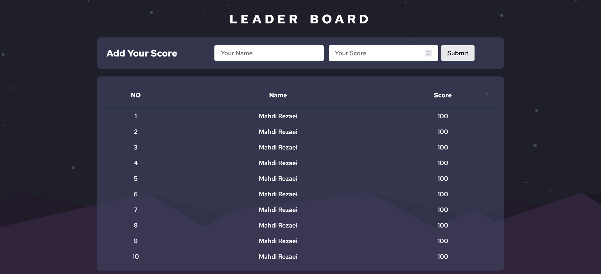
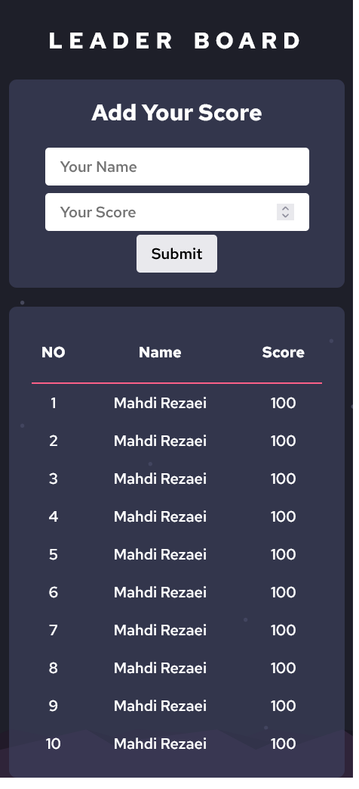

# Leader Board - JavaScript Project
## Table of contents

- [Overview](#overview)
  - [The challenge](#the-challenge)
  - [Screenshot](#screenshot)
  - [Links](#links)
- [Project Setup](#Setup-Project)
  - [commands](#command)
- [My process](#my-process)
  - [Built with](#built-with)
  - [What I learned](#what-i-learned)
  - [Continued development](#continued-development)
  - [Useful resources](#useful-resources)
- [Author](#author)
- [Acknowledgments](#acknowledgments)


## Overview

### The challenge

- Create a new game with the name of your choice by using the API.
- Make sure that you saved the ID of your game that will be returned by API.
- Implement the "Refresh" button that will get all scores for a game created by you from the API (receiving data from the API and parsing the JSON).
- Implement the form "Submit" button that will save a score for a game created by you (sending data to the API).
- Use arrow functions instead of the function keyword.
- Use async and await JavaScript features to consume the API

## Setup Project
### commands
In order to run this project locally in your machine follow the following steps

```
git clone https://github.com/MahdiSohaily/Leaderboard.git
cd Todo-app
npm install
npm run dev
npm run start
```

### Screenshot

| Desktop version                              |               Mobile Version                |
| -------------------------------------------- | :-----------------------------------------: |
|  |  |

### Links

- Live Site URL: [See Demo](https://mahdisohaily.github.io/Todo-app/)

## My process

### Built with

- Semantic HTML5 markup
- CSS custom properties
- Flexbox
- CSS Grid
- Mobile-first workflow
- Webpack 5
- JavaScript

## Author

- Frontend Mentor - [@MahdiSohaily](https://www.frontendmentor.io/profile/MahdiSohaily)
- Twitter - [@Mahdi_Rezaei_AF](https://twitter.com/Mahdi_Rezaei_AF)
- linkedIn - [@Mahdi-rezaei](https://www.linkedin.com/in/mahdi-rezaei-74705713b)
